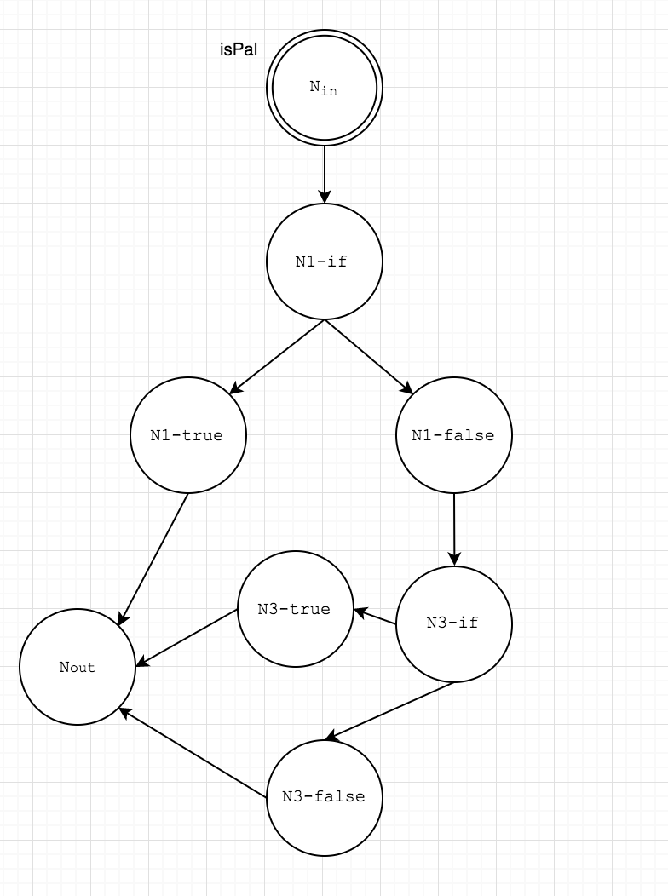

# cirrus-palindrome

## Calculating the largets palindromic number between two integers

The algorithm used in this program is purely **functional** and **referentially transparent**

This means: 
1. No mutations
2. No side effects
4. No loops
3. The result of either function could be replaced with a hard coded value and the functionality of the program would not change

### First function

This takes in an integer current and an integer limit. Current is the integer being evaluated, while limit 
    is smallest possible integer that can be evaluated.

If the number is found to be palindromic, it is returned. Otherwise, the function recurses.
```c++
std::string Palindrome::findPalindrome(const int current, const int limit) {
    if (current < limit) return "nothing";
    else {
        const std::string c = std::to_string(current);
        if (isPal(c, 0, (int)c.size()/2)) return c;
        else return findPalindrome(current - 1, limit);
    }
}
```

### Second function

This takes in the string representation of the number being evaluated, the current index, and the size of half the number.

If the function has reached the middle of the number, it returns true. Otherwise it either discovers that the number is not palindromic, or it recurses with the next index.

```c++
bool Palindrome::isPal(const std::string n, const int index, const int halfSize) {
    if (index == halfSize) return true;
    else {
        if (n.at(index) != n.at((n.size() - 1) - index)) return false;
        else return isPal(n, index + 1, halfSize);
    }
}
```

## Why do it this way?

If there is no mutations or side effects to a function, it makes it incredibly easy to test, maintain, read, etc. 

By looking at the Control flow graph for the function **isPal** we can see that only 3 unit tests would be needed for full path coverage (resulting in far greater fault detection than line coverage):


Imagine multiple loops with mutable values! 

## Running this program 

**Note:** The QT framework must be installed to run this program
        It can be downloaded [here](https://www.qt.io/download?hsCtaTracking=e7149b67-6bc4-4d7a-92d8-2a6198e7c0ef%7Cd589f70e-c5bb-44bc-bded-5f11d520fa77)

1. Open the QT Creator APP
2. Select File -> Open
3. Navigate to the Cirrus-Pal.pro file
4. Double click the file
5. Select Build -> Run

